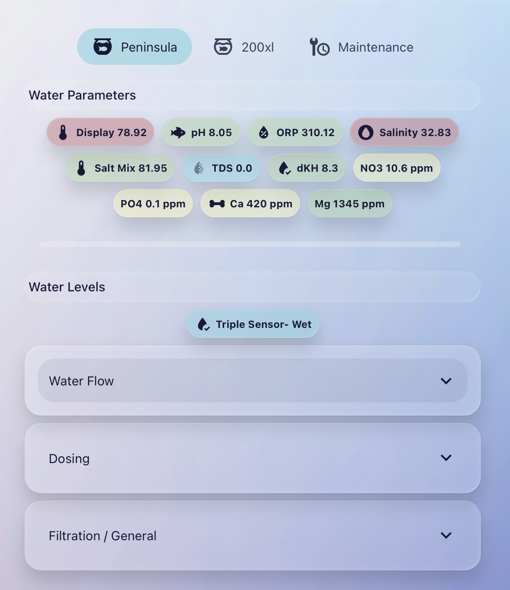
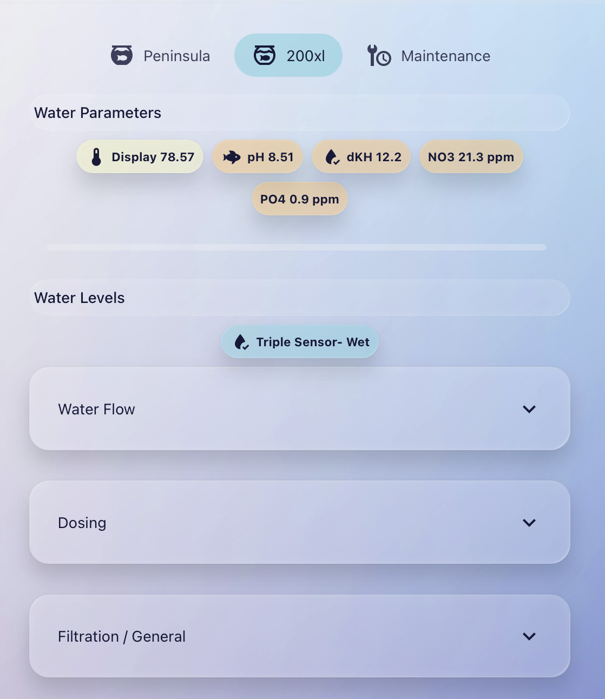
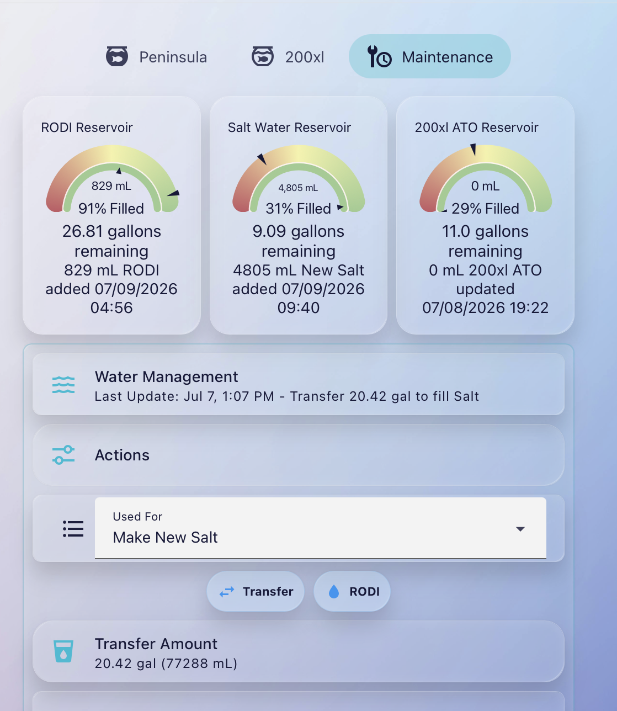
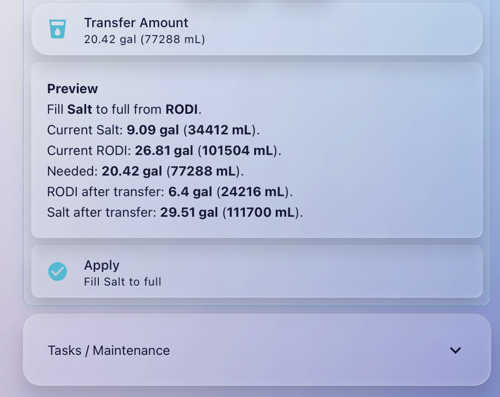
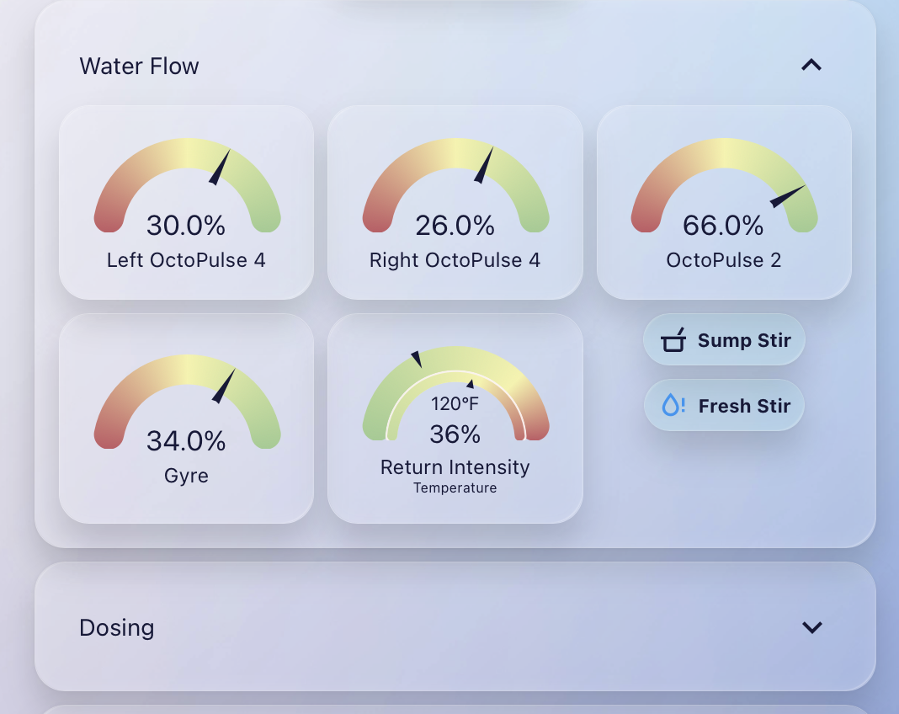
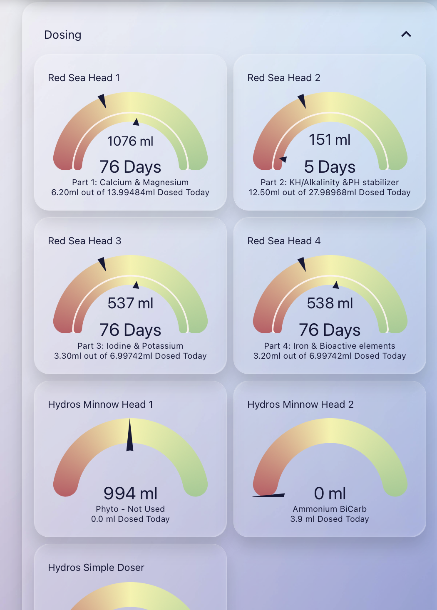
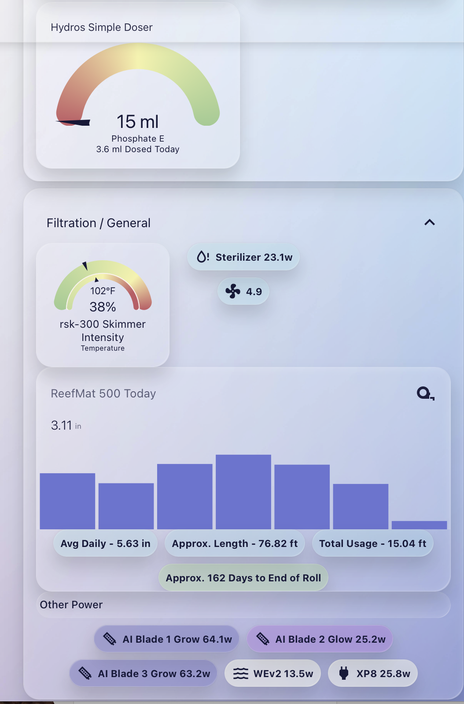

# Home Assistant Aquarium Dashboard

Home Assistant Aquarium Dashboard is a dashboard-centered Home Assistant configuration for monitoring and managing a multi-aquarium reef system from one place.

Maintained by [BR260354](https://github.com/BR260354).

The first major subsystem is the **Aquarium Water Management Suite**, a dashboard-first water inventory workflow for tracking RODI, saltwater, and Red Sea 200XL ATO water movement.

This project is built around a simple idea: aquarium management is easier when the dashboard is organized around real aquarium workflows instead of raw entities.

## What It Manages

The current system supports two independent aquariums.

### Peninsula Reef

The Peninsula is the primary display aquarium. It uses Hydros control hardware, automatic top off, automatic water change, dosing pumps, a RODI reservoir, and a saltwater reservoir.

Tracked reservoirs:

| Reservoir | Capacity | Notes |
| --- | ---: | --- |
| Peninsula RODI | 111,700 mL / 29.5 gal | Automatically refilled by Hydros |
| Peninsula Salt | 111,700 mL / 29.5 gal | Manually filled from RODI |

Dosing equipment:

- Red Sea ReefDose 4
- Hydros Minnow
- Hydros Simple Doser

### Red Sea 200XL

The Red Sea 200XL is a separate aquarium with an independent ATO reservoir and manual water changes.

Tracked reservoir:

| Reservoir | Capacity | Notes |
| --- | ---: | --- |
| 200XL ATO | 94,635 mL / about 25 gal normal AWMS target | Manually filled from Peninsula RODI |

Dosing equipment:

- Red Sea ReefDose 4

The 200XL ATO reservoir is filled from the Peninsula RODI reservoir. AWMS deducts the transferred amount from Peninsula RODI and increases the 200XL ATO estimate.

## Dashboard

The dashboard is the main interface for the system. Scripts, helpers, automations, and templates support the visible workflows.

Current dashboard work includes:

- Reservoir status cards for Peninsula RODI, Peninsula Salt, and 200XL ATO
- A Water Management panel under Maintenance
- Workflow-aware quick actions
- Unit chips for mL, L, oz, and gal
- Preview text before applying a change
- Apply workflow for removals and transfers
- Optional recent activity card using the Home Assistant Logbook

## Water Management Workflows

AWMS currently supports four primary workflows plus a manual fallback.

| Workflow | Source | Result |
| --- | --- | --- |
| Plants | RODI | Deducts Peninsula RODI |
| Make New Salt | RODI to Salt | Fills Salt to capacity and deducts RODI |
| 200XL ATO | RODI to 200XL ATO | Deducts RODI and increases 200XL ATO estimate |
| 200XL Water Change | Salt | Deducts Peninsula Salt |
| Other | User-selected RODI or Salt | Deducts the selected reservoir |

All inventory is stored internally in milliliters. The dashboard displays gallons for readability.

```text
1 gallon = 3785.41 mL
```

## Architecture

The system uses Home Assistant helpers, Lovelace dashboard YAML, Script UI scripts, and a small workflow-default automation.

Important entities:

| Purpose | Entity |
| --- | --- |
| Peninsula RODI inventory | `input_number.awms_rodi_remaining_ml` |
| Peninsula Salt inventory | `input_number.awms_salt_remaining_ml` |
| 200XL ATO inventory | `input_number.awms_200xl_ato_remaining_ml` |
| AWMS amount | `input_number.awms_adjustment_amount` |
| AWMS unit | `input_select.awms_adjustment_unit` |
| AWMS action | `input_select.awms_adjustment_action` |
| AWMS reservoir | `input_select.awms_source_reservoir` |
| AWMS workflow | `input_select.awms_workflow` |
| Apply adjustment script | `script.awms_apply_adjustment` |

Repository snippets:

| File | Purpose |
| --- | --- |
| [`snippets/awms-water-management-stack.yaml`]({{ site.github.repository_url }}/blob/main/snippets/awms-water-management-stack.yaml) | Main Water Management dashboard panel |
| [`snippets/awms-water-management-expander.yaml`]({{ site.github.repository_url }}/blob/main/snippets/awms-water-management-expander.yaml) | Alternate collapsible Water Management panel |
| [`snippets/awms-apply-adjustment-full-script.yaml`]({{ site.github.repository_url }}/blob/main/snippets/awms-apply-adjustment-full-script.yaml) | Script UI logic for applying water inventory changes |
| [`snippets/awms-sync-workflow-defaults-automation.yaml`]({{ site.github.repository_url }}/blob/main/snippets/awms-sync-workflow-defaults-automation.yaml) | Keeps workflow defaults aligned with the selected use case |
| [`snippets/awms-recent-activity-card.yaml`]({{ site.github.repository_url }}/blob/main/snippets/awms-recent-activity-card.yaml) | Optional recent activity dashboard card |

## Dashboard Preview

These screenshots show the dashboard in mobile portrait layout.

### Peninsula



### 200XL



### Water Management





### Equipment Sections







## Required Home Assistant Pieces

This project assumes:

- Home Assistant 2026.7.1 or newer-compatible script syntax
- Helpers created through the Home Assistant UI
- AWMS apply logic created through the Home Assistant Script UI
- Dashboard YAML added through Lovelace
- Inventory values stored in milliliters
- Gauge display values shown in gallons

Helpers and scripts are intentionally not defined in YAML files in this repository because they are created through the Home Assistant UI in the running system.

## HACS, Plugins, Integrations, And Credit

This dashboard relies on Home Assistant, community dashboard cards, and hardware integrations. Please install and credit the original projects.

| Project | Used For | Link |
| --- | --- | --- |
| Home Assistant | Automation platform, helpers, scripts, dashboards, logbook | [home-assistant.io](https://www.home-assistant.io/) |
| HACS | Installing and updating community frontend cards | [hacs.xyz](https://www.hacs.xyz/) |
| Mushroom | Template cards, select cards, chips, and the primary dashboard interaction style | [piitaya/lovelace-mushroom](https://github.com/piitaya/lovelace-mushroom) |
| card-mod | Lovelace card styling and visual polish | [thomasloven/lovelace-card-mod](https://github.com/thomasloven/lovelace-card-mod) |
| mod-card | Wrapper card used for the mobile-safe AWMS panel border | Included with/commonly used through [thomasloven/lovelace-card-mod](https://github.com/thomasloven/lovelace-card-mod) |
| Expander Card | Collapsible Water Management section | [MelleD/lovelace-expander-card](https://github.com/MelleD/lovelace-expander-card) |
| Gauge Card Pro | Reservoir gauge cards for RODI, Salt, and 200XL ATO display | [benjamin-dcs/gauge-card-pro](https://github.com/benjamin-dcs/gauge-card-pro) |
| Bubble Card | Section separators and dashboard structure | [Clooos/Bubble-Card](https://github.com/Clooos/Bubble-Card) |
| Mini Graph Card | Usage/history graph cards | [kalkih/mini-graph-card](https://github.com/kalkih/mini-graph-card) |
| Simple Tabs | Tabbed aquarium controller dashboard | [agoberg85/home-assistant-simple-tabs](https://github.com/agoberg85/home-assistant-simple-tabs) |
| Vertical Stack In Card | Grouped graph/chip layouts | [ofekashery/vertical-stack-in-card](https://github.com/ofekashery/vertical-stack-in-card) |
| Material Design Icons | Dashboard icons through Home Assistant `mdi:` icon names | [pictogrammers.com/library/mdi](https://pictogrammers.com/library/mdi/) |
| ReefBeat custom integration | Red Sea ReefBeat device data in Home Assistant | [Elwinmage/ha-reefbeat-component](https://github.com/Elwinmage/ha-reefbeat-component) |
| Hydros custom integration | Hydros controller device data in Home Assistant | [Bitf1ip/ha-hydros](https://github.com/Bitf1ip/ha-hydros) |
| Hydros / CoralVue | Aquarium controller hardware and water-level sensing | [coralvuehydros.com](https://www.coralvuehydros.com/) |

If your local dashboard uses additional HACS cards, custom themes, or integrations, add them to the table before publishing the full dashboard YAML.

## Design Notes

Color conventions:

| Item | Color |
| --- | --- |
| RODI | Blue |
| Salt | Purple |
| 200XL | Green |
| Remove | Red |
| Transfer | Blue |
| Preview | Yellow |
| Apply | Cyan |

Operational rules:

- Store inventory internally in milliliters only
- Display gallons only in the dashboard
- Keep workflow logic small and readable
- Prefer `if / then` blocks in Script UI logic
- Prefer `is_state()` comparisons in templates
- Avoid duplicated calculations where practical
- Keep dashboard sections visually consistent and easy to scan

## License And Attribution

This repository documents a personal Home Assistant aquarium automation setup maintained by [BR260354](https://github.com/BR260354). It is shared as a reference for other hobbyists who may want ideas for their own dashboards. The configuration here depends on the open-source and community projects credited above.

Before publishing a full dashboard export, review it for local entity names, secrets, private URLs, tokens, device IDs, and any personal data.
